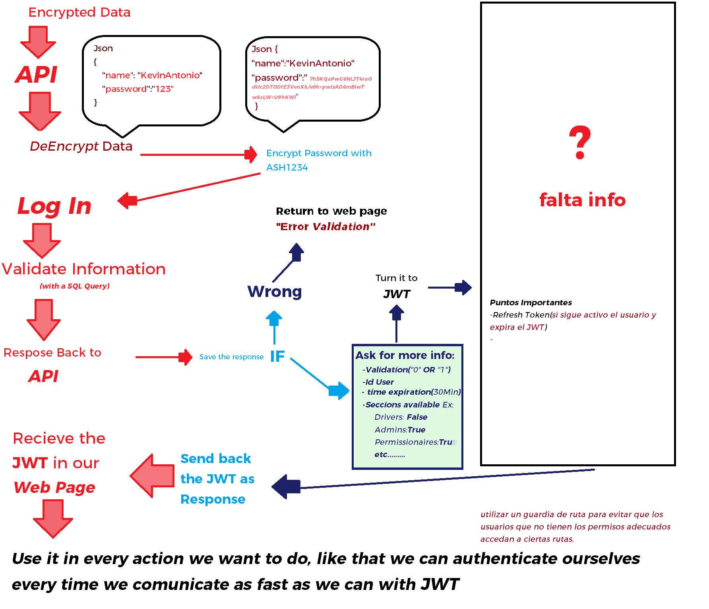
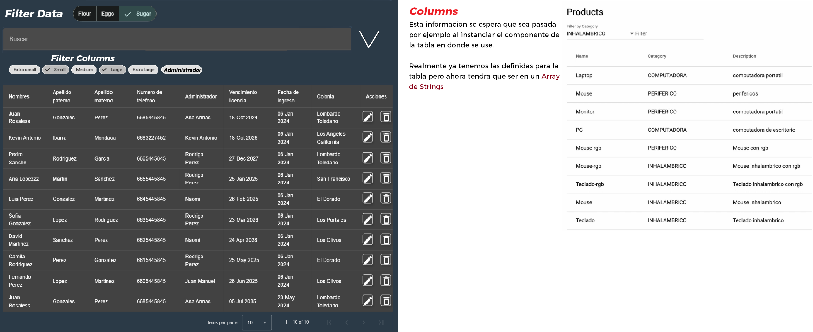
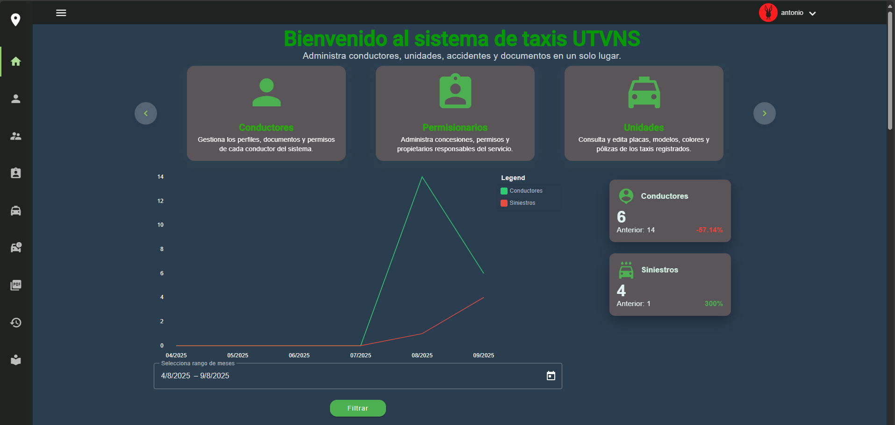

# 🚖 TaxisSqlTeo

Sistema web para la gestión de taxis, conductores y siniestros, con soporte para documentos digitales (PDFs e imágenes), autenticación por roles y estadísticas gráficas en tiempo real.

## 📌 Descripción general

Este proyecto surge como una solución integral para la administración de una flotilla de taxis.  
El sistema permite gestionar conductores, unidades, permissionarios y siniestros, así como almacenar y consultar documentos asociados a cada entidad.

La arquitectura está compuesta por:

- **Frontend (Angular 17)**: interfaz web desarrollada con Angular, Angular Material y librerías modernas para formularios reactivos, tablas y componentes visuales.  
- **Backend (API en .NET Framework)**: API RESTful encargada de toda la lógica de negocio, manejo de permisos y conexión con la base de datos.  
- **Base de datos (SQL Server en Azure SQL Database)**: almacenamiento principal de la información estructurada.  
- **Almacenamiento de archivos (Firebase Storage / Azure Blob Storage)**: gestión de PDFs e imágenes asociados a conductores, unidades y siniestros.  
- **Infraestructura en la nube (Azure App Service + Azure Static Web Apps)**:  
   - API desplegada en Azure App Service.  
   - Frontend hospedado en Azure Static Web Apps.  
   - Base de datos en Azure SQL Database.  

## 🔧 Tecnologías utilizadas

- **Angular 17** → Framework frontend principal.  
- **Angular Material** → Librería de componentes UI para formularios, tablas, diálogos y navegación.  
- **.NET Framework Web API** → Backend RESTful para toda la lógica del sistema.  
- **SQL Server (Azure SQL Database)** → Base de datos relacional para la persistencia de datos.  
- **Firebase Storage (alternativa: Azure Blob Storage)** → Almacenamiento de archivos multimedia y documentos.  
- **JWT (JSON Web Tokens)** → Autenticación y autorización de usuarios.  
- **Azure App Service** → Hospedaje de la API.  
- **Azure Static Web Apps** → Hospedaje del frontend Angular.  
- **CI/CD con GitHub Actions** → Automatización del despliegue en Azure al hacer push en GitHub.  

## 📁 Funcionalidad principal

- Registro y administración de conductores, unidades y permissionarios.  
- Registro y consulta de siniestros (accidentes).  
- Subida de documentos (PDF, imágenes) asociados a cada entidad.  
- Autenticación mediante JWT con distintos roles (administrador, usuario básico).  
- Dashboard con gráficas de:  
  - Conductores activos por mes.  
  - Siniestros por mes.  
  - Conductores con más siniestros en un rango de tiempo.  

## 🧪 Funcionalidades en desarrollo

- [ ] Imagen de perfil por usuario.  
- [ ] Personalización de la paleta de colores del sistema.  
- [ ] Crear una subpagina para mostrar a usuarios normales, donde solo puedan ver su informacion relacionada y no la de todos  
- [ ] Mostrar las imagenes como se espera

---
## 📂 Módulos del sistema

El sistema está dividido en módulos, cada uno orientado a una parte clave de la gestión de taxis, conductores y siniestros.

### 🏠 Home
- Muestra el **dashboard principal** con estadísticas gráficas en tiempo real:
  - Conductores activos por mes.
  - Siniestros registrados por periodo.
  - agradecimientos
  - tecnologias usadas
  - Grafica de puntos de crecimiento
- Es la primera pantalla después del login exitoso.

---

### 🔑 Login
- Pantalla inicial del sistema.  
- Permite la autenticación mediante **JWT**.  
- Los roles determinan el acceso a los diferentes módulos (administrador o usuario básico).  

---

### 👤 Create User
- Solo accesible para administradores.  
- Permite registrar nuevos usuarios del sistema.  
- Configuración de permisos para habilitar/deshabilitar acceso a módulos.  
- El administrador puede restablecer contraseñas, pero **nunca verlas directamente** por seguridad.

---

### 🚖 Drivers
- Registro y gestión de conductores.  
- Información personal, licencia, contacto de emergencia (en caso de accidente).  
- Relación con unidades y siniestros.  
- Subida y consulta de documentos relacionados al conductor.

---

### 🧑‍💼 Admins
- Módulo exclusivo para **administrar administradores**.  
- Permite crear cuentas con mayor nivel de acceso para gestión global.  

---

### 🧾 Permissionaires
- Gestión de permissionarios (propietarios de taxis).  
- Relación con las unidades y conductores que administra.  

---

### 🚕 Units
- Registro de taxis (unidades).  
- Información como marca, modelo, placas y número económico.  
- Relación con su permissionario y conductor actual.

---

### ⚠️ Sinisters
- Registro y gestión de **siniestros (accidentes)**.  
- Relación con conductor y unidad.  
- Subida de documentos como hojas de choque, dictámenes, etc.  

---

### 📄 Documents
- Subida y visualización de **documentos PDF e imágenes**.  
- Soporta pólizas de seguro, hojas de siniestros, contratos, etc.  
- Los archivos se guardan en Firebase Storage (actualmente) o Azure Blob Storage (alternativa más profesional).  
- La metadata (tipo de documento, relación, fecha de carga) se guarda en **SQL Server**.

---

### ⚙️ Extra Data
Módulo para **catálogos poco modificables**, accesible solo para el administrador. Incluye:  
- **brandCar** → Marcas de autos.  
- **modelCar** → Modelos de autos.  
- **relationShip** → Relación con el permissionario.  
- **status** → Estado de un conductor o unidad.  
- **sinisterType** → Tipos de siniestros.  
- **insuranceName** → Nombres de aseguradoras.  
- **insurers** → Agentes de seguros.  
- **streets** y **settlements** → Catálogo de calles y colonias.

---

### 📊 Logs
Registro interno del sistema para trazabilidad:
- **Login History** → Quién inició sesión, cuándo y con qué usuario.  
- **Error Logs** → Explicación detallada de fallos ocurridos en el sistema.  
- **Change Logs** → Registro de cambios en tablas críticas, solicitado para auditoría.  

---

### ❌ Error Page
- Página genérica para cuando un usuario intenta acceder a una ruta inexistente.  

## 🚀 Cómo correr localmente

1. Clonar el repositorio.  
2. Configurar la cadena de conexión de la API en `web.config`.  
3. Restaurar paquetes NuGet en el proyecto .NET.  
4. En Angular, instalar dependencias con `npm install`.  
5. Correr el frontend con `ng serve`.

---

## 📦 Despliegue en producción

- **Frontend (Angular)**: desplegado en Azure Static Web Apps con integración CI/CD desde GitHub.
-    Puede entrar al link de la pagina web en azure
-     https://ashy-coast-0886de010.2.azurestaticapps.net 
- **Backend (API .NET Framework)**: desplegado en Azure App Service.  
- **Base de datos**: Azure SQL Database.  
- **Archivos (PDFs/Imágenes)**: Firebase Storage (actual) o Azure Blob Storage (recomendado).  

---

## 📸 Capturas de pantalla

Aqui se puede observar el orden y manejo interno de los datos para poder llevar a cabo correctamente el logIn
---

En esta imagen esta una funcion la cual se implementara a futuro para darle mas dinamismo a la pagina web
---

This is the First version from our web page working and deployed in azure
---

## 📄 Licencia
MIT
